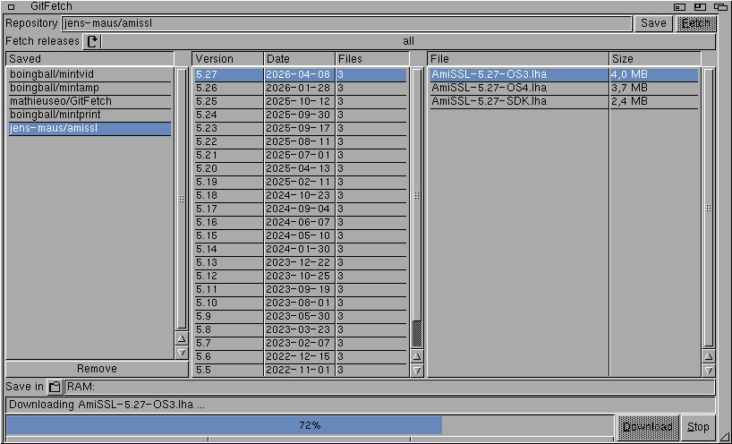
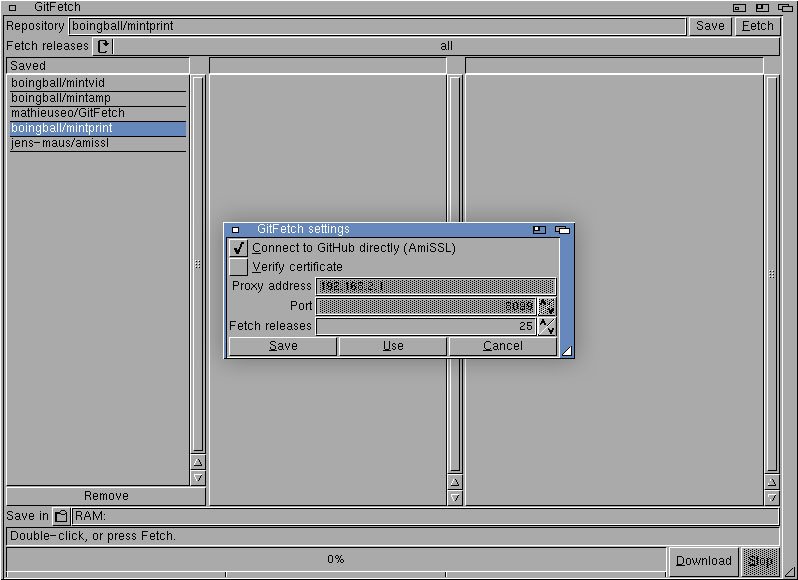
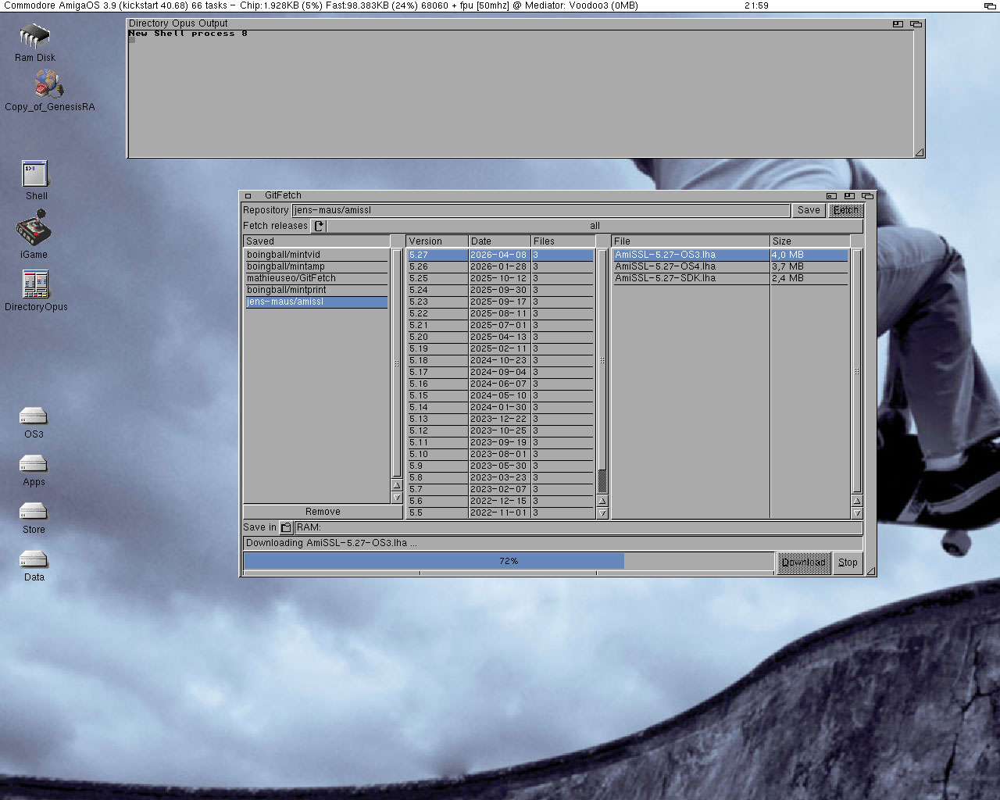

# GitFetch

Fetch GitHub releases on an Amiga, without any hassle.

Nearly all new Amiga software is published through GitHub releases, which
is awkward since there is no way to download the releases on the machine itself: no browser for the platform can handle
the CSS and JavaScript Github.com relies on. Getting to the newest `.lha`
usually means walking over to a modern computer and transfer it back to your Amiga (what is your method of choice?)

GitFetch does that part for you. Type a GitHub address or `owner/repo`, 
pick a release and a file, and it lands on your hard drive. Capitals do
not matter: `boingball/mintprint` finds `boingball/MintPRINT`.

It downloads, and nothing else. Unpacking and installing stay in your own
hands, with the tools you already trust.



Saved repositories on the left, releases in the middle, the files in that
release on the right. Running on an A1200 with a Blizzard 1260.

## Requirements

- AmigaOS 3.5 or newer, for the ReAction classes
- Recommended: 68020 or better 
- A screen of 640x400 or larger
- A TCP/IP stack: Roadshow, AmiTCP, Miami or Genesis
- [AmiSSL](https://github.com/jens-maus/amissl) 5 or newer
- A correctly set system clock (for the SSL negotiation to work)

That last one is easy to overlook. An Amiga without a working
battery-backed clock starts in 1978, and every TLS certificate then looks
"not yet valid", so the connection fails with an error that says nothing
about dates. GitFetch checks the date before connecting and says so
plainly. It does not set the clock itself; that belongs to a proper time
program such as the NTP client built into Roadshow.

## Two ways to reach GitHub with GitFetch

There are two options to download from your favorite repo, switchable in the settings.

**Directly, through AmiSSL.** No server of your own needed. GitHub sends its full
reply (around 240 KB for 25 releases), mostly release notes that get
thrown away — and all of it passes through TLS decryption on a 68k.

**Through a proxy.** A small Python script, included, using only the
standard library. It turns the same reply into about 5 KB of plain text,
already converted to the Amiga character set, and caches it so GitHub's
limit of 60 requests per hour is not an issue. Faster and lighter, but it
only works while that server runs.

The setting for how many releases to fetch matters most on a direct
connection: `latest` costs a fraction of `all`.



Fields that do not apply to your choice are greyed out: with a direct
connection the proxy details are irrelevant, and the other way round the
certificate check is.

## Building

Cross-compiled with [bebbo's amiga-gcc](https://codeberg.org/bebbo/amiga-gcc)
and the AmigaOS 3.9 NDK. See [doc/toolchain.md](doc/toolchain.md) for the
full setup, including four pitfalls that will otherwise cost you an
evening.

```sh
make test        # host tests: parser and URL normalisation
make test-proxy  # proxy: signing, allowlist, text conversion
make test-json   # JSON parser against a reference implementation
make fuzz        # 500,000 rounds of malformed input
make amiga       # cross-compile
make dist        # build the distribution archive
```

`make dist` uses a real LhA if one is available, which compresses; without
it, it falls back to `tools/make_lha.py`, which writes a valid archive but
stores everything uncompressed. A macOS binary is at
[amigavision/LhA](https://github.com/amigavision/LhA); put it at
`$AMIGA_PREFIX/bin/amiga-lha` or point `LHA=` at it. The difference is
roughly a factor of two.

The first four run on any machine with a C compiler and Python; no Amiga
or cross-compiler needed. The parsers are deliberately written so they can
be tested that way.

## Layout

| Path | What |
|---|---|
| `src/` | the Amiga program |
| `include/` | shared headers |
| `server/` | the proxy; standard library only |
| `test/` | host tests, fuzzer, and a POSIX shim to exercise the network code |
| `tools/` | icon writer, and an LhA writer as a fallback |
| `pkg/` | guide, installer script and Aminet description |
| `doc/` | toolchain notes, protocol, wishlist |

## Notes for the curious

A few things turned out to be more interesting than expected, and are
written up in [doc/toolchain.md](doc/toolchain.md):

- `printf` on AmigaOS reads 32-bit arguments: `%ld` with a `(long)` cast,
  never `%d`. Getting this wrong produced a bug that looked like a network
  fault for a whole evening.
- Most ReAction classes do not register under their name, so
  `NewObject(NULL, "string.gadget", ...)` returns NULL. You have to ask
  the library for the class pointer. Confusingly, `button.gadget` does
  accept the name form.
- NDK headers document tags that the OS 3.9 classes do not have. An
  unknown tag is silently ignored, which looks exactly like a bug in your
  own code.

## In its natural habitat



AmigaOS 3.9, 68060 at 50 MHz, Voodoo3 through a Mediator. Downloading
AmiSSL, which is what makes the direct connection work in the first place.

## Known bugs

None (yet).

Fixed in 0.2: the window did not reopen where you left it, and the button
beside "Save in" did nothing. Both reported by yelworC on amiga-news.de. If you find one, please
[open an issue](https://github.com/MathieuSEO/GitFetch/issues) and say
which AmigaOS version, which TCP/IP stack, and whether you were using a
direct connection or the proxy. That narrows it down considerably.

## Ideas for later

Kept deliberately short: this runs on machines with 2 MB of RAM, and a
feature nobody uses still costs memory for everyone. The full list, with
what each would cost, is in [doc/wishlist.md](doc/wishlist.md).

**Running on OS 3.0 to 3.4 through ClassAct.** ReAction grew out of
ClassAct and uses the same class names and tags, but those classes report
as version 41/42 while GitFetch asks `OpenLibrary` for 44. Lowering that
requirement for the five classes it really needs would bring those systems
in for anyone who installs ClassAct. A few lines of code; needs a test
round under emulation first. This is the most likely next change.

**Transfer speed while downloading.** The numbers are already there. On a
slow line there is currently no way to tell "slow" from "stuck", which
worries people needlessly.

**Remembering the last repository** between runs, and **sortable columns**
in the lists.

**More languages.** The groundwork is done: every string goes through
`gf_str()` and `locale.library` is opened at startup. A translation is a
catalog in `LOCALE:Catalogs/<language>/` and costs no code at all. Waiting
for someone who wants to make one.

Three things are deliberately left out, with reasons in the wishlist:
unpacking after download, an NTP client to set the clock, and an ARexx
port.

## Thanks

Jens Maus and everyone behind AmiSSL, Everyone at the [Amiga.cafe](https://amiga.cafe),
RVO for my Amiga revival. Darren Banfi, whose [Mint projects](https://github.com/boingball) started this, 
and every (vibe) coder still keeping our old girlfriend alive. And you for using it! 

## Licence

Freeware. Use it, share it, take it apart.

(c) 2026 Mathieu Burgerhout
